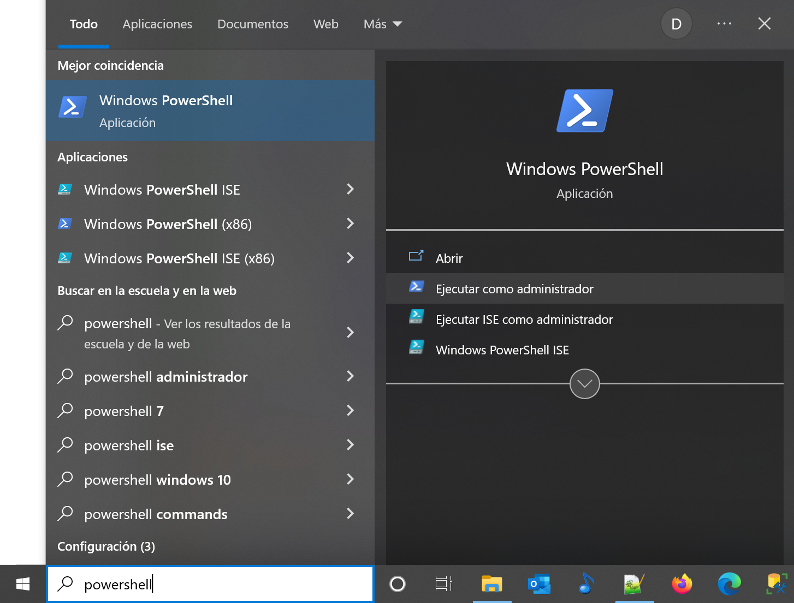

# logfile2windowsevent
Scan a live log file and generate windows events when a log file line contains a certain text.

# Objetivo

Esta utilidad monitoriza un **fichero vivo de log de aplicación**, 
y si en una nueva línea encuentra un patrón determinado de texto 
generará un **evento** en un **log de Windows** del **registro de eventos Windows**.

# Definiciones

- **Fichero vivo de log de aplicación**:
	- El fichero de texto plano donde una aplicación anota su actividad generando una nueva línea descriptiva de cada acción significativa que realice o resultado inesperado que obtenga.
	- Este fichero está abierto y bloqueado por la aplicación mientras esta ejecute, permitiendo sólo la lectura.
- **Registro de eventos Windows**:
	- Cada ocurrencia de un evento (acción, error de un programa o de un servicio, inicio de sesión, etc.) se recoge en los registros de Windows. Estos son el equivalente de los logs para el sistema operativo. Así, la información contenida permite resolver problemas en Windows y también en otros programas instalados en el equipo.
	- Internamente se organiza en diversos **logs de Windows** dentro de cada uno de los cuales los eventos se pueden asociar a diversos **orígenes** y **Categorías**
- **Log de Windows**
	- Primer nivel de clasificación lógica de los **eventos ** en el **registro de eventos Windows**.
- **Origen de eventos**
	- Atributo de un **evento** en el **registro de eventos Windows** que constituye el segundo nivel de clasificación de eventos. Se asocia a una aplicación, módulo de software, etc.
	- Dentro de un **log de Windows** se puede definir al menos una origen.
	- En inglés, *source*.
- **Categoría de eventos**
	- Atributo de un **evento** en el **registro de eventos Windows** que permite clasificar eventos si se usa. 
	- Para definir categorías de eventos es necesario crear un *category message file*, compilarlo a fichero de recursos con una primera herramienta de desarrollo, y transformar este fichero de recursos en una DLL con una segunda herramienta de desarrollo.
	- Este script de monitorización de ficheros de log y generación de eventos usa solo las herramientas de Windows por defecto (PowerShell) y de momento no entra al uso de categorías en aras de la simplicidad de uso.
- **Visor de eventos de Windows**:
	- Aplicación de sistema de Windows que permite ver los diversos eventos en el registro.
- **Evento** 
	- Entrada lógica del **registro de eventos de Windows**.
	- Clasificado dentro de un **log de Windows** y un **origen de eventos**
	- Muestra estos atributos en el visor de eventos para un **log** y opcionalmente **origen** dados:
		- **Nivel** Gravedad del evento: Informativo, advertencia, error...
		- **Fecha y hora** Momento en que sucedió.
		- **Origen** Aplicación, módulo que causó el evento.
		- **Id. del evento** Identificador único del tipo de evento.
		- **Categoría**	Clasificación arbitraria del evento. Sin el uso de ficheros descriptivos de categorías compilados en DLL, los eventos insertados por este script mostrarán un número como categoría.

Visor de eventos de windows (ejecutar *eventvwr.msc*)


# Tutorial

## Generar eventos del tutorial

- Descargar a local el código de este sitio github, con clone o en un zip.

- Arrancar Powershell como administrador. Esto evita tener que registrar los scripts descargados, tarea que harán los administradores para ejecutar luego en producción.



- En la consola de Powershell, ir al directorio que contiene los scripts.

- Arrancar el generador de log ejemplo (*log/generated.log*):
```
PS C:\...\logfile2windowsevent> start powershell .\generaLog.ps1
```
Este generador de log añade una linea cada dos segundos, 
y cada tres o cada cuatro lineas el contenido de esa linea 
es una frase aleatoria en latín con el prefijo **TRIVIUM:** o **QUADRIVIUM:**
según la periodicidad de la línea.
```
01/19/2023 09:46:06 - 0 - QUADRIVIUM: Aenean fringilla non ligula a rutrum.
01/19/2023 09:46:08 - 1 - Doin' stuff'n'shit
01/19/2023 09:46:10 - 2 - Doin' stuff'n'shit
01/19/2023 09:46:12 - 3 - TRIVIUM: Orci varius natoque penatibus et magnis dis parturient montes, nascetur ridiculus mus.
01/19/2023 09:46:14 - 4 - QUADRIVIUM: Quisque fringilla tempor nulla.
01/19/2023 09:46:16 - 5 - Doin' stuff'n'shit
01/19/2023 09:46:18 - 6 - TRIVIUM: Suspendisse potenti.
01/19/2023 09:46:20 - 7 - Doin' stuff'n'shit
01/19/2023 09:46:22 - 8 - QUADRIVIUM: Quisque faucibus odio erat, sed laoreet dolor porttitor a.
01/19/2023 09:46:24 - 9 - TRIVIUM: Duis iaculis, lectus at ullamcorper accumsan, arcu elit pharetra orci, a finibus augue nibh aliquam arcu.
01/19/2023 09:46:26 - 10 - Doin' stuff'n'shit
01/19/2023 09:46:28 - 11 - Doin' stuff'n'shit
01/19/2023 09:46:30 - 12 - QUADRIVIUM: Vestibulum ante ipsum primis in faucibus orci luctus et ultrices posuere cubilia curae; Suspendisse vitae dignissim turpis.
01/19/2023 09:46:32 - 13 - Doin' stuff'n'shit
01/19/2023 09:46:34 - 14 - Doin' stuff'n'shit
```
- Arrancar el scipt de escucha de log y generación de eventos. Interrumpirlo (*Ctr-C*) cuando haya registrado unos cuatro eventos.
```
PS C:\...\logfile2windowsevent> .\listenLogGenEvents.ps1
Textos a buscar en los logs, y el id de evento que se asociará a cada uno de ellos
TRIVIUM: -> 2001 [Warning]
QUADRIVIUM: -> 2002 [Error]
Creando la fuente de eventos AppVideoSrc en el event log AppVideoLog
Log:   01/19/2023 10:59:15 - 8 - QUADRIVIUM: Quisque faucibus odio erat, sed laoreet dolor porttitor a.
Event: 2002 [Error] Quisque faucibus odio erat, sed laoreet dolor porttitor a.
Log:   01/19/2023 10:59:17 - 9 - TRIVIUM: Duis iaculis, lectus at ullamcorper accumsan, arcu elit pharetra orci, a finibus augue nibh aliquam arcu.
Event: 2001 [Warning] Duis iaculis, lectus at ullamcorper accumsan, arcu elit pharetra orci, a finibus augue nibh aliquam arcu.
Log:   01/19/2023 10:59:23 - 12 - QUADRIVIUM: Vestibulum ante ipsum primis in faucibus orci luctus et ultrices posuere cubilia curae; Suspendisse vitae dignissim turpis.
Event: 2002 [Error] Vestibulum ante ipsum primis in faucibus orci luctus et ultrices posuere cubilia curae; Suspendisse vitae dignissim turpis.
Log:   01/19/2023 10:59:29 - 15 - TRIVIUM: Duis mattis dolor a dolor feugiat semper.
Event: 2001 [Warning] Duis mattis dolor a dolor feugiat semper.
Ctrl-C
PS C:\...\logfile2windowsevent>
```
El inicio del log informa:
- Qué marcas de texto (TRIVIUM y QUADRIVIUM) se buscará en cada línea del fichero de log.
- Para cada marca el id de evento de Windows que se generará y su nivel.
```
Textos a buscar en los logs, y el id de evento que se asociará a cada uno de ellos
TRIVIUM: -> 2001 [Warning]
QUADRIVIUM: -> 2002 [Error]
```
Dado que no existe ni el log ni la fuente en el registro de eventos de Windows, se informa de su creación.
```
Creando la fuente de eventos AppVideoSrc en el event log AppVideoLog
```
Cada vez que en una línea del log se encuentra una marca, se muestra esa línea
y el id, nivel y mensaje para el evento de Windows generado.
```
Log:   01/19/2023 10:59:15 - 8 - QUADRIVIUM: Quisque faucibus odio erat, sed laoreet dolor porttitor a.
Event: 2002 [Error] Quisque faucibus odio erat, sed laoreet dolor porttitor a.
```

## Ver eventos del tutorial

- Ejecutar *eventvwr.msc*

